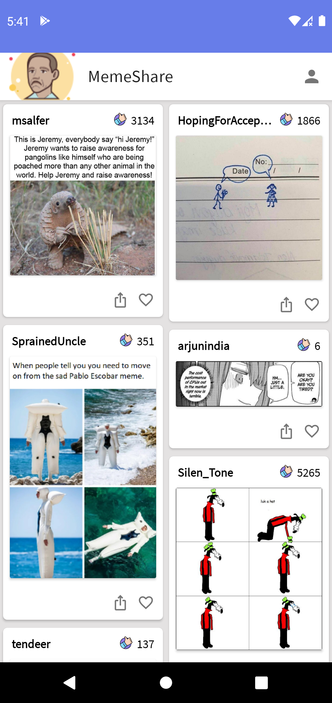
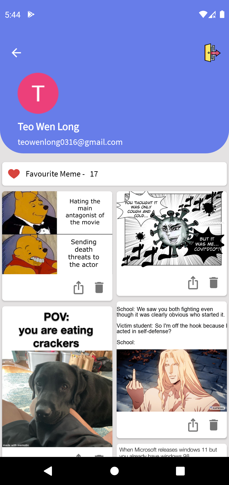
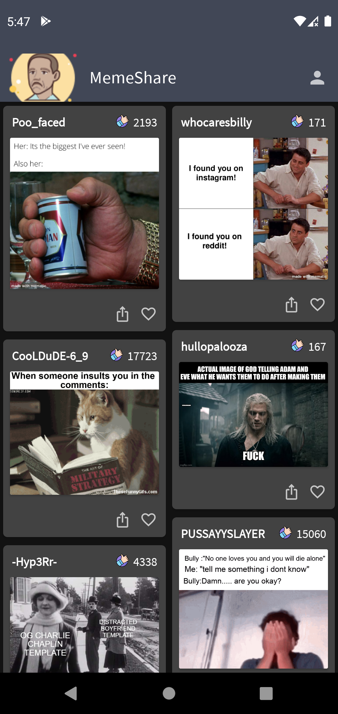
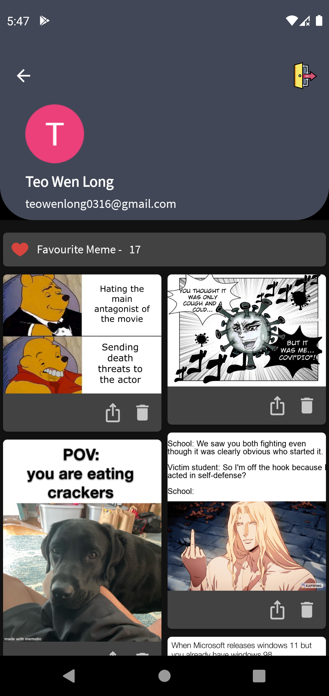
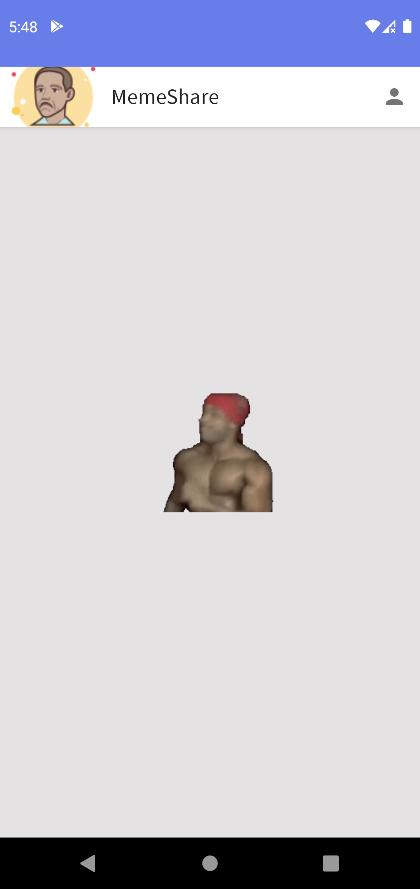

# MemeShare
"Meme" topic related project to participate in [Philip's app war](https://youtu.be/NSBTAc3mL5I)

## Features
- Display random meme scraped from reddit. 
- Able to favourite your own meme
- View all favourited meme in your profile.
- Directly share the meme to your friends with any social media apps!
- Nicely design Collapsing Toolbar in Profile Page.
- Ricardo Milos as your loading indicator :heart_eyes:

## Tech-stack
- **MVVM architecture** (ViewModel, Repository)
- Single Activity with **Navigation Component**
- Networking with **Retrofit**, **Coroutines** and **Flow**
- **Firebase Authentication & Firestore**
- Dependency Injection with **Dagger-Hilt**
- Image loading - **Coil**
- Collapsing Toolbar design

